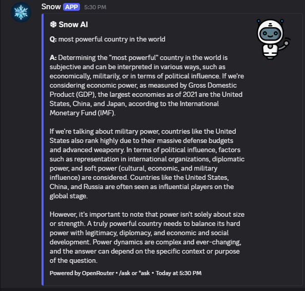

# Azan Creation - Discord Bot Portfolio

Welcome! I’m **Azan**, a developer passionate about building **custom Discord bots** and **modern websites**.  
Here’s a showcase of my work in Discord development.  

---

## Features I Build
- Moderation — kick, ban, mute, warn, detailed logs  
- Fun & Games — Truth/Dare, memes, Would You Rather, mini-games  
- AI Chat Integration — smart replies, AFK system, conversation memory  
- Server Utilities — role management, custom embeds, automod  
- Can Add Custom Features — According To Customer Demand
---

## Bot Screenshots
 

Examples from my custom projects:  

  
*Interactive bot help menu with categorized commands*  

  
*Ban/Kick system with professional embed logs*  

  
*AI chat system integrated into Discord for real-time responses*  

  
*Perfect custom games to play with your friends to pass time*  

  
*AI chat system integrated into Discord for real-time responses*  

  
*Other Discord Basic Features with customizable prefix e.g /av /serverinfo etc*  

---

## Tech Stack
- JavaScript / TypeScript  
- Node.js  
- Discord.js v14  
- AI APIs (OpenRouter, HuggingFace)  

---

## Contact
Looking for a custom bot or website?  
Check out my Fiverr: [Click Here](https://www.fiverr.com/)  
